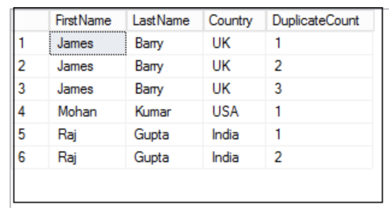

## SQL SERVER

https://sqliteonline.com/


### JOINS:
-- Formula for outer joins:

Left join = inner join + fetch any additional records from the left table which are not present in the right.

Right join = inner join + fetches any records from the right table which are not present in the left

Full join = inner join
                + fetch additional records from the left table which are not present in right table
                + fetch additional records from the right table which are not present in left table.

### Quick Recap
```sql
SELECT c1, c2
FROM T1
INNER/LEFT/RIGHT/OUTER JOIN T2
ON T1.col = T2.col
WHERE condition
```
***Nth Highest***
```sql
WITH CTE AS
(
  SELECT
    salary,
    DENSE_RANK() OVER (ORDER BY salary) as Rank
  FROM Employee
)

SELECT TOP 1 salary FROM CTE WHERE RANK = 5
//5th Highest
```


### INNER JOIN

The `INNER JOIN` keyword selects records that have matching values in both tables.
```sql
SELECT column_name(s)
FROM table1
INNER JOIN table2
ON table1.column_name = table2.column_name
```

The above is same as:
```sql
SELECT column_name(s)
FROM table1
JOIN table2 //INNER is just syntactic sugar
ON table1.column_name = table2.column_name
```

### LEFT JOIN
```sql
SELECT column_name(s)
FROM table1
LEFT JOIN table2
ON table1.column_name = table2.column_name;
```

The `LEFT JOIN` keyword returns all records from the left table (table1), and the matching records from the right table (table2). The result is 0 records from the right side, if there is no match.

### RIGHT JOIN
```sql
SELECT column_name(s)
FROM table1
RIGHT JOIN table2
ON table1.column_name = table2.column_name;
```

The `RIGHT JOIN` keyword returns all records from the right table (table2), and the matching records from the left table (table1). The result is 0 records from the left side, if there is no match.

### FULL OUTER JOIN
The `FULL OUTER JOIN` keyword returns all records when there is a match in left (table1) or right (table2) table records.

Tip: `FULL OUTER JOIN` and `FULL JOIN` are the same.

```sql
SELECT column_name(s)
FROM table1
FULL OUTER JOIN table2
ON table1.column_name = table2.column_name
WHERE condition;
```

### SELF JOIN
```sql
SELECT column_name(s)
FROM table1 T1, table1 T2
WHERE condition;
```

### CROSS JOIN
```sql
SELECT column_name(s)
FROM table1 T1
CROSS JOIN table1 T2
```
This is a cartesian product. If Table 1 has 10 records and Table 2 has 5, then CROSS JOIN will produce 50. Each row from Table 1 will be matched with 5 in table 2.

### UNION
The `UNION` operator is used to combine the result-set of two or more `SELECT` statements.
```sql
SELECT City FROM Customers
UNION
SELECT City FROM Suppliers
ORDER BY City;
```

### UNION ALL: 
The `UNION` operator selects only distinct values by default. To allow duplicate values, use `UNION ALL`:

### RANK:
```sql
SELECT Studentname,
   	Subject,
   	Marks,
   	RANK() OVER(PARTITION BY StudentName ORDER BY Marks ) Rank
FROM ExamResult
ORDER BY Studentname,
     	Rank;
```

### DENSE_RANK
```sql
SELECT Studentname,
   	Subject,
   	Marks,
   	DENSE_RANK() OVER(PARTITION BY StudentName ORDER BY Marks ) Rank
FROM ExamResult
ORDER BY Studentname,
     	Rank
```

Similar values are ranked same (say n) in both but next value will be ranked n+1 in dense rank but n+2 in rank (assuming there were rows with same value). There will be gaps in rank when RANK is used, no gaps with DENSE_RANK.

**<span style="text-decoration:underline;">To Find Nth Highest Salary Using A Sub-Query</span>**
1. **<code>SELECT TOP 1 SALARY  </code></strong>
2. <strong><code>FROM (  </code></strong>
3. <code>      <strong>SELECT</strong> <strong>DISTINCT</strong> <strong>TOP</strong> 1 SALARY  </code>
4. <code>      <strong>FROM</strong> tbl_Employees  </code>
5. <code>      <strong>ORDER</strong> <strong>BY</strong> SALARY <strong>DESC</strong>  </code>
6. <code>      ) RESULT  </code>
7. <strong><code>ORDER BY SALARY </code></strong>

```sql
SELECT top 1 OrderID FROM (select top 3 orderid from orders order by orderid desc) order by orderid asc
```

### To Find The Nth Highest Salary Using CTE
1. **<code>WITH RESULT AS  </code></strong>
2. <code>(  </code>
3. <code>    <strong>SELECT</strong> SALARY,  </code>
4. <code>           DENSE_RANK() OVER (<strong>ORDER</strong> <strong>BY</strong> SALARY <strong>DESC</strong>) <strong>AS</strong> DENSERANK  </code>
5. <code>    <strong>FROM</strong> tbl_Employees  </code>
6. <code>)  </code>
7. <strong><code>SELECT TOP 1 SALARY  </code></strong>
8. <strong><code>FROM RESULT  </code></strong>
9. <strong><code>WHERE DENSERANK = 1 &lt;<--- use 3 for 3rd highest</code></strong>

### 2nd highest salary:

```sql
WITH CTE AS
(
select Name, Salary, RN = ROW_NUMBER()
OVER (ORDER BY Salary desc)
FROM Employee
)

select Name, salary from CTE where RN = 2
```

A **common table expression**, or CTE, is a temporary named result set created from a simple `SELECT` statement that can be used in a subsequent `SELECT` statement. Each SQL CTE is like a **named query**, whose result is stored in a virtual table (a CTE) to be referenced later in the main query.

```sql
WITH my_cte AS (
  SELECT a,b,c
  FROM T1
)
SELECT a,c
FROM my_cte
WHERE ....
```

SQL Server tries always to generate the most optimized execution plan for each stored procedure the first time that the stored procedure is executed. The SQL Server Engine looks at the stored procedure passed parameter values when compiling the stored procedure, the first execution, in order to create the optimal plan including the parameters and keep that plan for future use in the plan cache. This parameter analysis process is called the **Parameter Sniffing**. It can be disabled at database level.

To overcome parameter sniffing performance issue that could occur due to forcing the same plan usage for all stored procedures parameters values we can use the **WITH RECOMPILE** option in the stored procedure definition, which will force the stored procedure compilation at each execution, creating a new execution plan for each parameter value. 

A **clustered index** defines the order in which data is physically stored in a table. Table data can be sorted in only one way, therefore, there can be only one clustered index per table. In SQL Server, the primary key constraint automatically creates a clustered index on that particular column.

To see all the indexes on a particular table execute “sp_helpindex” stored procedure. 

PRIMARY KEY constraint differs from the UNIQUE constraint in that; you can create multiple UNIQUE constraints in a table, with the ability to define only one SQL PRIMARY KEY per each table. Another difference is that **the UNIQUE constraint allows for one NULL value, but the PRIMARY KEY does not allow NULL values**

**Order of execution for SQL keywords:**

**FROM, WHERE, SELECT, ORDER BY**

**With Group BY/HAVING**

**FROM, WHERE, GROUP BY, HAVING, SELECT, ORDER BY**

```sql
CREATE VIEW view_name AS
SELECT column1, column2, ...
FROM table_name
WHERE condition;
```

**Exception Handling:**

```sql
USE AdventureWorks2014
GO
-- Basic example of TRY...CATCH

BEGIN TRY
-- Generate a divide-by-zero error  
  SELECT
    1 / 0 AS Error;
END TRY
BEGIN CATCH
  SELECT
    ERROR_NUMBER() AS ErrorNumber,
    ERROR_STATE() AS ErrorState,
    ERROR_SEVERITY() AS ErrorSeverity,
    ERROR_PROCEDURE() AS ErrorProcedure,
    ERROR_LINE() AS ErrorLine,
    ERROR_MESSAGE() AS ErrorMessage;
END CATCH;
GO
```

**IN Vs EXISTS - performance EXISTS is faster bcoz it exits when condition is met**

**DELETE duplicate rows:**

**Let Table has 4 columns ID, FirstName, LastName, Country. ID is unique PK.**

```sql
DELETE FROM [SampleDB].[dbo].[Employee]
    WHERE ID NOT IN
    (
        SELECT MAX(ID) AS MaxRecordID
        FROM [SampleDB].[dbo].[Employee]
        GROUP BY [FirstName],
             	[LastName],
             	[Country]
    );

WITH CTE([FirstName],
    [LastName],
    [Country],
    DuplicateCount)
AS (SELECT [FirstName],
       	[LastName],
       	[Country],
       	ROW_NUMBER() OVER(PARTITION BY [FirstName],
                                          [LastName],
                                          [Country]
       	ORDER BY ID) AS DuplicateCount
    FROM [SampleDB].[dbo].[Employee])
DELETE FROM CTE
WHERE DuplicateCount > 1;
```




**Scalar Functions: A scalar function accepts any number of parameters and returns one value.The term scalar differentiates a single, "flat" value from more complex structured values, such as arrays or result sets.  This pattern is much like that of traditional functions written in common programming language.**

**Table-Valued Functions: This type of functions returns a result set, much like a view. How ever ,unlike a view,functions can accept parameters. The inline function's syntax is quite simple.In the function definition, the return type is set to a table. A return statement is used with a select query in parenthesis.**

**Table-valued functions are "just" parameterized views. This makes them extremely powerful for encapsulating logic that would otherwise be hidden behind an opaque stored procedure.**


```sql
drop table employee;
create table employee
( emp_ID int
, emp_NAME varchar(50)
, DEPT_NAME varchar(50)
, SALARY int);


insert into employee values(101, 'Mohan', 'Admin', 4000);
insert into employee values(102, 'Rajkumar', 'HR', 3000);
insert into employee values(103, 'Akbar', 'IT', 4000);
insert into employee values(104, 'Dorvin', 'Finance', 6500);
insert into employee values(105, 'Rohit', 'HR', 3000);
insert into employee values(106, 'Rajesh',  'Finance', 5000);
insert into employee values(107, 'Preet', 'HR', 7000);
insert into employee values(108, 'Maryam', 'Admin', 4000);
insert into employee values(109, 'Sanjay', 'IT', 6500);
insert into employee values(110, 'Vasudha', 'IT', 7000);
insert into employee values(111, 'Melinda', 'IT', 8000);
insert into employee values(112, 'Komal', 'IT', 10000);
insert into employee values(113, 'Gautham', 'Admin', 2000);
insert into employee values(114, 'Manisha', 'HR', 3000);
insert into employee values(115, 'Chandni', 'IT', 4500);
insert into employee values(116, 'Satya', 'Finance', 6500);
insert into employee values(117, 'Adarsh', 'HR', 3500);
insert into employee values(118, 'Tejaswi', 'Finance', 5500);
insert into employee values(119, 'Cory', 'HR', 8000);
insert into employee values(120, 'Monica', 'Admin', 5000);
insert into employee values(121, 'Rosalin', 'IT', 6000);
insert into employee values(122, 'Ibrahim', 'IT', 8000);
insert into employee values(123, 'Vikram', 'IT', 8000);
insert into employee values(124, 'Dheeraj', 'IT', 11000);
COMMIT;


/* **************
Summary
************** */

select * from employee;

-- Using Aggregate function as Window Function
-- Without window function, SQL will reduce the no of records.
select dept_name, max(salary) from employee
group by dept_name;

-- By using MAX as an window function, SQL will not reduce records but the result will be shown corresponding to each record.
select e.*,
max(salary) over(partition by dept_name) as max_salary
from employee e;

-- row_number(), rank() and dense_rank()
select e.*,
row_number() over(partition by dept_name) as rn
from employee e;

-- Fetch the first 2 employees from each department to join the company.
select * from (
   select e.*,
   row_number() over(partition by dept_name order by emp_id) as rn
   from employee e) x
where x.rn < 3;

-- Fetch the top 3 employees in each department earning the max salary.
select * from (
   select e.*,
   rank() over(partition by dept_name order by salary desc) as rnk
   from employee e) x
where x.rnk < 4;

-- Checking the different between rank, dense_rnk and row_number window functions:
select e.*,
rank() over(partition by dept_name order by salary desc) as rnk,
dense_rank() over(partition by dept_name order by salary desc) as dense_rnk,
row_number() over(partition by dept_name order by salary desc) as rn
from employee e;

-- lead and lag

-- fetch a query to display if the salary of an employee is higher, lower or equal to the previous employee.
select e.*,
lag(salary) over(partition by dept_name order by emp_id) as prev_empl_sal,
case when e.salary > lag(salary) over(partition by dept_name order by emp_id) then 'Higher than previous employee'
    when e.salary < lag(salary) over(partition by dept_name order by emp_id) then 'Lower than previous employee'
    when e.salary = lag(salary) over(partition by dept_name order by emp_id) then 'Same than previous employee' end as sal_range
from employee e;

-- Similarly using lead function to see how it is different from lag.
select e.*,
lag(salary) over(partition by dept_name order by emp_id) as prev_empl_sal,
lead(salary) over(partition by dept_name order by emp_id) as next_empl_sal
from employee e;

-- Script to create the Product table and load data into it.

DROP TABLE product;
CREATE TABLE product
(
   product_category varchar(255),
   brand varchar(255),
   product_name varchar(255),
   price int
);

INSERT INTO product VALUES
('Phone', 'Apple', 'iPhone 12 Pro Max', 1300),
('Phone', 'Apple', 'iPhone 12 Pro', 1100),
('Phone', 'Apple', 'iPhone 12', 1000),
('Phone', 'Samsung', 'Galaxy Z Fold 3', 1800),
('Phone', 'Samsung', 'Galaxy Z Flip 3', 1000),
('Phone', 'Samsung', 'Galaxy Note 20', 1200),
('Phone', 'Samsung', 'Galaxy S21', 1000),
('Phone', 'OnePlus', 'OnePlus Nord', 300),
('Phone', 'OnePlus', 'OnePlus 9', 800),
('Phone', 'Google', 'Pixel 5', 600),
('Laptop', 'Apple', 'MacBook Pro 13', 2000),
('Laptop', 'Apple', 'MacBook Air', 1200),
('Laptop', 'Microsoft', 'Surface Laptop 4', 2100),
('Laptop', 'Dell', 'XPS 13', 2000),
('Laptop', 'Dell', 'XPS 15', 2300),
('Laptop', 'Dell', 'XPS 17', 2500),
('Earphone', 'Apple', 'AirPods Pro', 280),
('Earphone', 'Samsung', 'Galaxy Buds Pro', 220),
('Earphone', 'Samsung', 'Galaxy Buds Live', 170),
('Earphone', 'Sony', 'WF-1000XM4', 250),
('Headphone', 'Sony', 'WH-1000XM4', 400),
('Headphone', 'Apple', 'AirPods Max', 550),
('Headphone', 'Microsoft', 'Surface Headphones 2', 250),
('Smartwatch', 'Apple', 'Apple Watch Series 6', 1000),
('Smartwatch', 'Apple', 'Apple Watch SE', 400),
('Smartwatch', 'Samsung', 'Galaxy Watch 4', 600),
('Smartwatch', 'OnePlus', 'OnePlus Watch', 220);
COMMIT;

-- All the SQL Queries written here
select * from product;

-- FIRST_VALUE
-- Write query to display the most expensive product under each category (corresponding to each record)
select *,
first_value(product_name) over(partition by product_category order by price desc) as most_exp_product
from product;

-- LAST_VALUE
-- Write query to display the least expensive product under each category (corresponding to each record)
select *,
first_value(product_name)
   over(partition by product_category order by price desc)
   as most_exp_product,
last_value(product_name)
   over(partition by product_category order by price desc
       range between unbounded preceding and unbounded following)
   as least_exp_product   
from product
WHERE product_category ='Phone';


-- Alternate way to write SQL query using Window functions
select *,
first_value(product_name) over w as most_exp_product,
last_value(product_name) over w as least_exp_product   
from product
WHERE product_category ='Phone'
window w as (partition by product_category order by price desc
           range between unbounded preceding and unbounded following);
               
-- NTH_VALUE
-- Write query to display the Second most expensive product under each category.
select *,
first_value(product_name) over w as most_exp_product,
last_value(product_name) over w as least_exp_product,
nth_value(product_name, 5) over w as second_most_exp_product
from product
window w as (partition by product_category order by price desc
           range between unbounded preceding and unbounded following);

-- NTILE
-- Write a query to segregate all the expensive phones, mid range phones and the cheaper phones.
select x.product_name,
case when x.buckets = 1 then 'Expensive Phones'
    when x.buckets = 2 then 'Mid Range Phones'
    when x.buckets = 3 then 'Cheaper Phones' END as Phone_Category
from (
   select *,
   ntile(3) over (order by price desc) as buckets
   from product
   where product_category = 'Phone') x;


-- CUME_DIST (cumulative distribution) ;
/*  Formula = Current Row no (or Row No with value same as current row) / Total no of rows */

-- Query to fetch all products which are constituting the first 30%
-- of the data in products table based on price.
select product_name, cume_dist_percetage
from (
   select *,
   cume_dist() over (order by price desc) as cume_distribution,
   round(cume_dist() over (order by price desc)::numeric * 100,2)||'%' as cume_dist_percetage
   from product) x
where x.cume_distribution <= 0.3;

-- PERCENT_RANK (relative rank of the current row / Percentage Ranking)
/* Formula = Current Row No - 1 / Total no of rows - 1 */

-- Query to identify how much percentage more expensive is "Galaxy Z Fold 3" when compared to all products.
select product_name, per
from (
   select *,
   percent_rank() over(order by price) ,
   round(percent_rank() over(order by price)::numeric * 100, 2) as per
   from product) x
where x.product_name='Galaxy Z Fold 3';

CTE, WITH clause

-- QUERY 1 :
drop table emp;
create table emp
( emp_ID int
, emp_NAME varchar(50)
, SALARY int);


insert into emp values(101, 'Mohan', 40000);
insert into emp values(102, 'James', 50000);
insert into emp values(103, 'Robin', 60000);
insert into emp values(104, 'Carol', 70000);
insert into emp values(105, 'Alice', 80000);
insert into emp values(106, 'Jimmy', 90000);

select * from emp;

with avg_sal(avg_salary) as
       (select cast(avg(salary) as int) from emp)
select *
from emp e
join avg_sal av on e.salary > av.avg_salary

-- QUERY 2 :
DrOP table sales ;
create table sales
(
   store_id        int,
   store_name      varchar(50),
   product         varchar(50),
   quantity        int,
   cost            int
);
insert into sales values
(1, 'Apple Originals 1','iPhone 12 Pro', 1, 1000),
(1, 'Apple Originals 1','MacBook pro 13', 3, 2000),
(1, 'Apple Originals 1','AirPods Pro', 2, 280),
(2, 'Apple Originals 2','iPhone 12 Pro', 2, 1000),
(3, 'Apple Originals 3','iPhone 12 Pro', 1, 1000),
(3, 'Apple Originals 3','MacBook pro 13', 1, 2000),
(3, 'Apple Originals 3','MacBook Air', 4, 1100),
(3, 'Apple Originals 3','iPhone 12', 2, 1000),
(3, 'Apple Originals 3','AirPods Pro', 3, 280),
(4, 'Apple Originals 4','iPhone 12 Pro', 2, 1000),
(4, 'Apple Originals 4','MacBook pro 13', 1, 2500);


select * from sales;

-- Find total sales per each store
select s.store_id, sum(s.cost) as total_sales_per_store
from sales s
group by s.store_id;

-- Find average sales with respect to all stores
select cast(avg(total_sales_per_store) as int) avg_sale_for_all_store
from (select s.store_id, sum(s.cost) as total_sales_per_store
   from sales s
   group by s.store_id) x;

-- Find stores who's sales where better than the average sales accross all stores
select *
from   (select s.store_id, sum(s.cost) as total_sales_per_store
               from sales s
               group by s.store_id
      ) total_sales
join   (select cast(avg(total_sales_per_store) as int) avg_sale_for_all_store
               from (select s.store_id, sum(s.cost) as total_sales_per_store
                   from sales s
                       group by s.store_id) x
      ) avg_sales
on total_sales.total_sales_per_store > avg_sales.avg_sale_for_all_store;

-- Using WITH clause
WITH total_sales as
       (select s.store_id, sum(s.cost) as total_sales_per_store
       from sales s
       group by s.store_id),
   avg_sales as
       (select cast(avg(total_sales_per_store) as int) avg_sale_for_all_store
       from total_sales)
select *
from   total_sales
join   avg_sales
on total_sales.total_sales_per_store > avg_sales.avg_sale_for_all_store;


Recursive SQL Queries

-- RECURSIVE SQL QUERIES in PostgreSQL, Oracle, MSSQL & MySQL
/* Recursive Query Structure/Syntax
WITH [RECURSIVE] CTE_name AS
   (
    SELECT query (Non Recursive query or the Base query)
       UNION [ALL]
    SELECT query (Recursive query using CTE_name [with a termination condition])
   )
SELECT * FROM CTE_name;
*/


/* Difference in Recursive Query syntax for PostgreSQL, Oracle, MySQL, MSSQL.
- Syntax for PostgreSQL and MySQL is the same.
- In MSSQL, RECURSIVE keyword is not required and we should use UNION ALL instead of UNION.
- In Oracle, RECURSIVE keyword is not required and we should use UNION ALL instead of UNION. Additionally, we need to provide column alias in WITH clause itself
*/


-- Queries:
-- Q1: Display number from 1 to 10 without using any in built functions.
-- Q2: Find the hierarchy of employees under a given manager "Asha".
-- Q3: Find the hierarchy of managers for a given employee "David".


/* TABLE CREATION SCRIPT - PostgreSQL, Oracle, MSSQL */
DROP TABLE emp_details;
CREATE TABLE emp_details
   (
       id           int PRIMARY KEY,
       name         varchar(100),
       manager_id   int,
       salary       int,
       designation  varchar(100)


   );


INSERT INTO emp_details VALUES (1,  'Shripadh', NULL, 10000, 'CEO');
INSERT INTO emp_details VALUES (2,  'Satya', 5, 1400, 'Software Engineer');
INSERT INTO emp_details VALUES (3,  'Jia', 5, 500, 'Data Analyst');
INSERT INTO emp_details VALUES (4,  'David', 5, 1800, 'Data Scientist');
INSERT INTO emp_details VALUES (5,  'Michael', 7, 3000, 'Manager');
INSERT INTO emp_details VALUES (6,  'Arvind', 7, 2400, 'Architect');
INSERT INTO emp_details VALUES (7,  'Asha', 1, 4200, 'CTO');
INSERT INTO emp_details VALUES (8,  'Maryam', 1, 3500, 'Manager');
INSERT INTO emp_details VALUES (9,  'Reshma', 8, 2000, 'Business Analyst');
INSERT INTO emp_details VALUES (10, 'Akshay', 8, 2500, 'Java Developer');
commit;
/* ************************************************************************** */


/* TABLE CREATION SCRIPT - MySQL */
DROP TABLE demo.emp_details;
CREATE TABLE demo.emp_details
   (
       id           int PRIMARY KEY,
       name         varchar(100),
       manager_id   int,
       salary       int,
       designation  varchar(100)
   );

INSERT INTO demo.emp_details VALUES (1,  'Shripadh', NULL, 10000, 'CEO');
INSERT INTO demo.emp_details VALUES (2,  'Satya', 5, 1400, 'Software Engineer');
INSERT INTO demo.emp_details VALUES (3,  'Jia', 5, 500, 'Data Analyst');
INSERT INTO demo.emp_details VALUES (4,  'David', 5, 1800, 'Data Scientist');
INSERT INTO demo.emp_details VALUES (5,  'Michael', 7, 3000, 'Manager');
INSERT INTO demo.emp_details VALUES (6,  'Arvind', 7, 2400, 'Architect');
INSERT INTO demo.emp_details VALUES (7,  'Asha', 1, 4200, 'CTO');
INSERT INTO demo.emp_details VALUES (8,  'Maryam', 1, 3500, 'Manager');
INSERT INTO demo.emp_details VALUES (9,  'Reshma', 8, 2000, 'Business Analyst');
INSERT INTO demo.emp_details VALUES (10, 'Akshay', 8, 2500, 'Java Developer');
commit;
/* ************************************************************************** */


/* Q1: Display number from 1 to 10 without using any in built functions. */
-- PostgreSQL
with recursive num as
   (select 1 as n
   union
   select n+1 as n
   from num where n < 10
   )
select * from num;


-- Oracle
with num (n) as
   (select 1 as n from dual
   union all
   select n+1 as n
   from num where n < 10
   )
select * from num;


-- MSSQL (Microsoft SQL Server)
with num as
   (select 1 as n
   union all
   select n+1 as n
   from num where n < 10
   )
select * from num;


-- MySQL
with recursive num as
   (select 1 as n
   union
   select n+1 as n
   from num where n < 10
   )
select * from num;
/* ************************************************************************** */


/* Q2: Find the hierarchy of employees under a given manager */
-- PostgreSQL
with recursive managers as
   (select id as emp_id, name as emp_name, manager_id
    , designation as emp_role, 1 as level
    from emp_details e where id=7
    union
    select e.id as emp_id, e.name as emp_name, e.manager_id
    , e.designation as emp_role, level+1 as level
    from emp_details e
    join managers m on m.emp_id = e.manager_id)
select *
from managers;


-- Oracle
with  managers (emp_id, emp_name, manager_id, designation, lvl) as
   (select id as emp_id, name as emp_name, manager_id
    , designation as emp_role, 1 as lvl
    from emp_details e where id=7
    union all
    select e.id as emp_id, e.name as emp_name, e.manager_id
    , e.designation as emp_role, lvl+1 as lvl
    from emp_details e
    join managers m on m.emp_id = e.manager_id)
select *
from managers;


-- MSSQL (Microsoft SQL Server)
with  managers as
   (select id as emp_id, name as emp_name, manager_id
    , designation as emp_role, 1 as level
    from emp_details e where id=7
    union all
    select e.id as emp_id, e.name as emp_name, e.manager_id
    , e.designation as emp_role, level+1 as level
    from emp_details e
    join managers m on m.emp_id = e.manager_id)
select *
from managers;


-- MySQL
with recursive managers as
   (select id as emp_id, name as emp_name, manager_id
    , designation as emp_role, 1 as level
    from demo.emp_details e where id=7
    union
    select e.id as emp_id, e.name as emp_name, e.manager_id
    , e.designation as emp_role, level+1 as level
    from demo.emp_details e
    join managers m on m.emp_id = e.manager_id)
select *
from managers;
/* ************************************************************************** */


/* Q2-A: Find the hierarchy of employees under a given employee. Also displaying the manager name. */
-- PostgreSQL
with recursive managers as
   (select id as emp_id, name as emp_name, manager_id
    , designation as emp_role, 1 as level
    from emp_details e where id=7
    union
    select e.id as emp_id, e.name as emp_name, e.manager_id
    , e.designation as emp_role, level+1 as level
    from emp_details e
    join managers m on m.emp_id = e.manager_id)
select m.emp_id, m.emp_name, m.manager_id, e.name as manager_name
, m.emp_role, m.level
from managers m
join emp_details e on e.id=m.manager_id;
/* ************************************************************************** */


/* Q3: Find the hierarchy of managers for a given employee */
-- PostgreSQL
with recursive managers as
   (select id as emp_id, name as emp_name, manager_id
    , designation as emp_role, 1 as level
    from emp_details e where id=7
    union
    select e.id as emp_id, e.name as emp_name, e.manager_id
    , e.designation as emp_role, level+1 as level
    from emp_details e
    join managers m on m.manager_id = e.id)
select *
from managers;


-- Oracle
with  managers (emp_id, emp_name, manager_id, designation, lvl) as
   (select id as emp_id, name as emp_name, manager_id
    , designation as emp_role, 1 as lvl
    from emp_details e where id=7
    union all
    select e.id as emp_id, e.name as emp_name, e.manager_id
    , e.designation as emp_role, lvl+1 as lvl
    from emp_details e
    join managers m on m.manager_id = e.id)
select *
from managers;


-- MSSQL (Microsoft SQL Server)
with  managers (emp_id, emp_name, manager_id, designation, lvl) as
   (select id as emp_id, name as emp_name, manager_id
    , designation as emp_role, 1 as lvl
    from emp_details e where id=7
    union all
    select e.id as emp_id, e.name as emp_name, e.manager_id
    , e.designation as emp_role, lvl+1 as lvl
    from emp_details e
    join managers m on m.manager_id = e.id)
select *
from managers;


-- MySQL
with recursive managers as
   (select id as emp_id, name as emp_name, manager_id
    , designation as emp_role, 1 as level
    from demo.emp_details e where id=7
    union
    select e.id as emp_id, e.name as emp_name, e.manager_id
    , e.designation as emp_role, level+1 as level
    from demo.emp_details e
    join managers m on m.manager_id = e.id)
select *
from managers;
/* ************************************************************************** */
```
